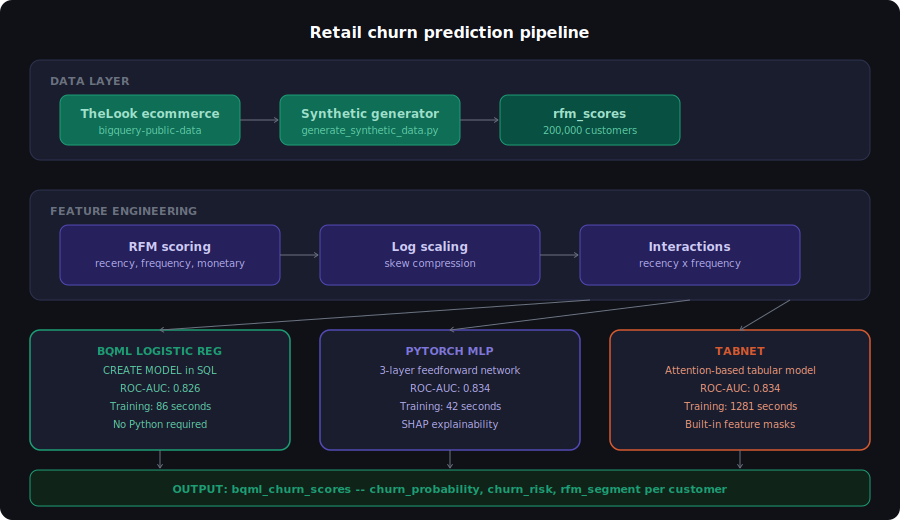
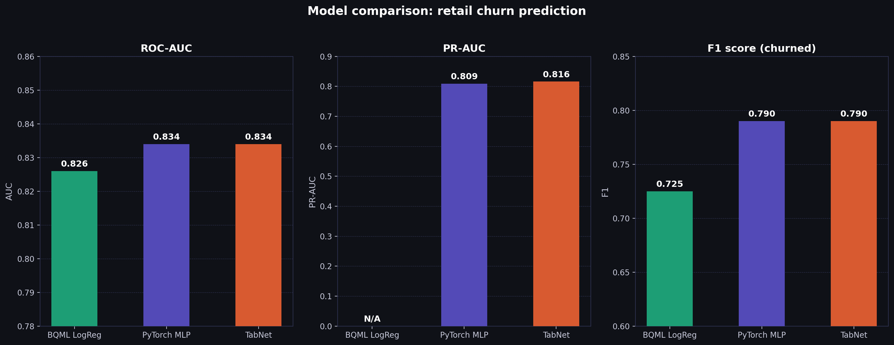
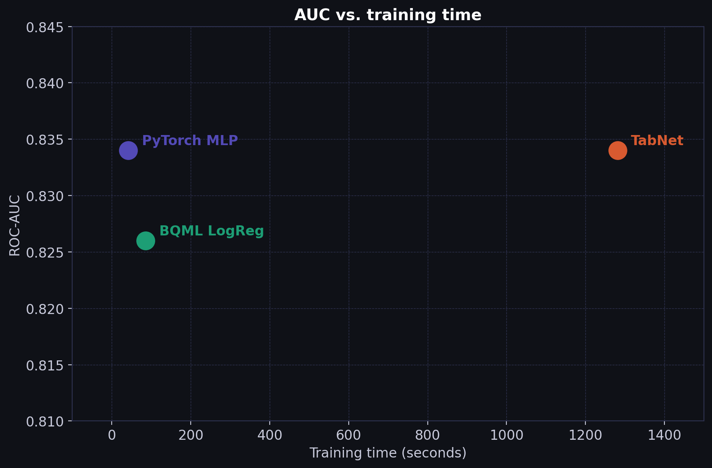
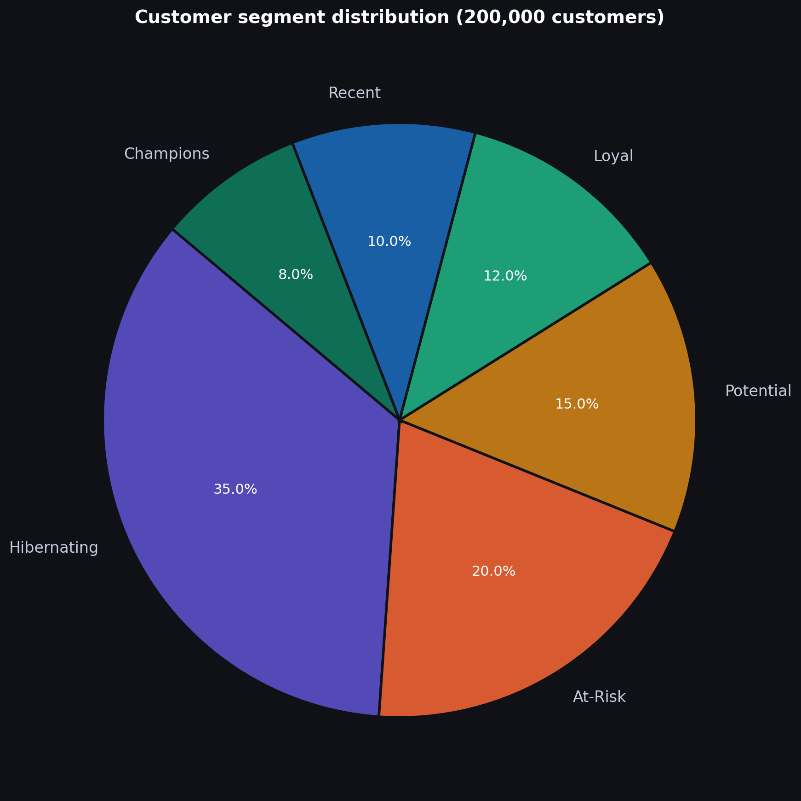
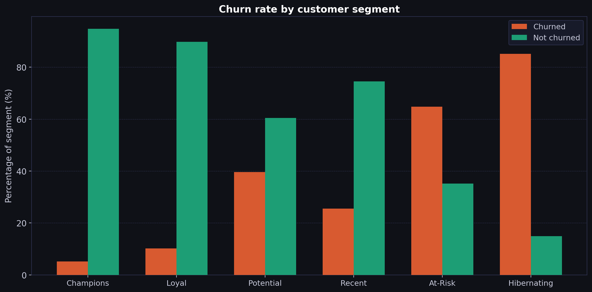
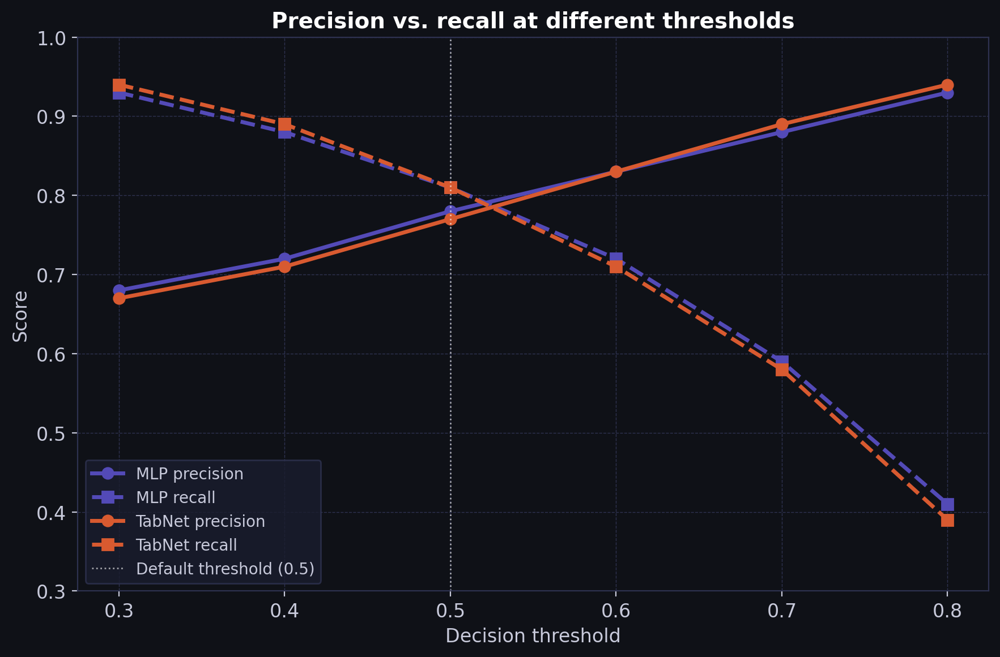
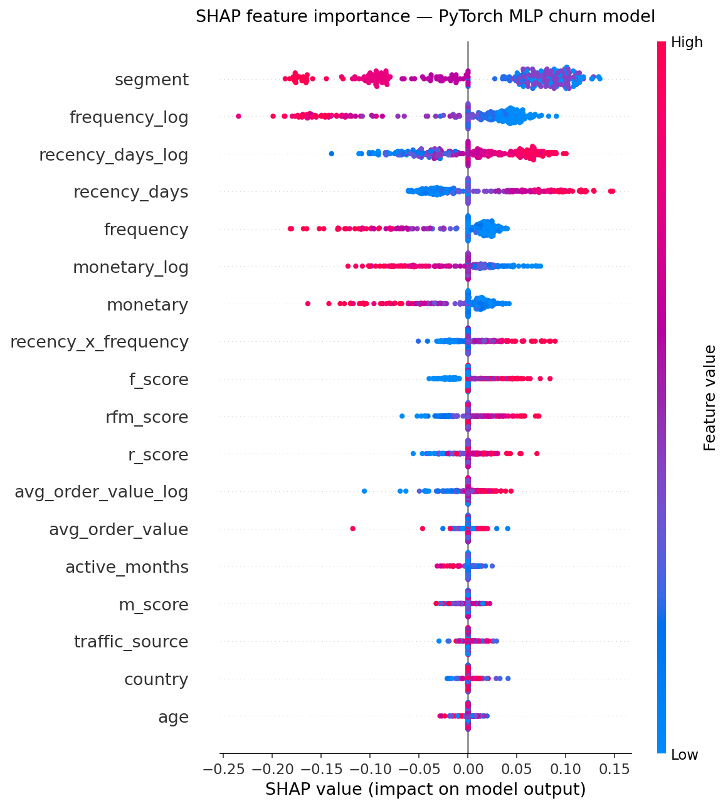
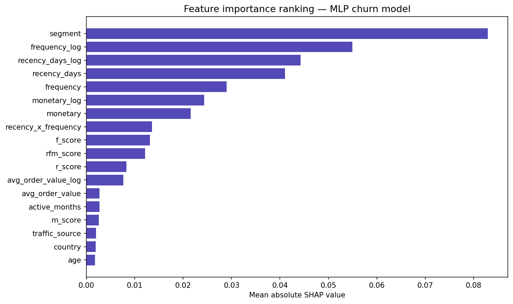

# retail-churn-pytorch

Retail customer churn prediction using PyTorch MLP and TabNet trained on 200,000
synthetic retail customers across six behavioral segments with RFM features.
Part of a two-repo comparison against a BigQuery ML logistic regression baseline.

Companion repo: https://github.com/gbhorne/retail-churn-bqml

---

## Architecture



---

## Results

| Model | ROC-AUC | PR-AUC | F1 (churned) | Training time |
|-------|---------|--------|--------------|---------------|
| BQML logistic regression | 0.826 | N/A | 0.725 | 86s |
| PyTorch MLP | 0.834 | 0.809 | 0.790 | 42s |
| TabNet | 0.834 | 0.816 | 0.790 | 1,281s |

All three models land within 0.008 AUC of each other. Neural network complexity
does not meaningfully improve accuracy on clean tabular RFM data. The real
differences are explainability, portability, and infrastructure cost.

---

## Charts















---

## Exploitation guide

### Understanding the output

The scored output table bqml_churn_scores contains one row per customer with:

- churn_probability: A float between 0 and 1. Model confidence that the customer
  will not purchase again within the scoring window.
- churn_risk: High (>=0.7), Medium (>=0.4), Low (<0.4). Bucketed for
  campaign targeting.
- rfm_segment: Champions, Loyal, Potential, Recent, At-Risk, Hibernating.
  Derived from RFM scores independently of the churn model.

### Choosing a decision threshold

The default threshold of 0.5 is not always the right business decision.

If your win-back campaign costs $5 and recovers $80 in lifetime value, the
breakeven threshold is 5/80 = 0.063. Flag any customer above 0.063, not 0.5.
This dramatically increases recall at the cost of precision.

If your campaign is expensive (direct mail, sales call), raise the threshold
to 0.7 or higher to maximize precision.

Use the precision vs. recall chart to pick the threshold that matches your
campaign economics.

### Segment action playbook

| Segment | Churn risk | Recommended action | Channel |
|---------|-----------|-------------------|---------|
| Champions | High | Loyalty reward, early access to new products | Email |
| Champions | Medium | Points bonus, VIP status reminder | Email |
| Loyal | High | 10-15% discount on next order | Email + SMS |
| Loyal | Medium | Free shipping on next order | Email |
| At-Risk | High | Win-back offer, 15-20% discount, urgency messaging | Email + SMS |
| At-Risk | Medium | Re-engagement content, product recommendation | Email |
| Potential | High | Onboarding nudge, social proof content | Email |
| Recent | High | Second purchase incentive, free shipping | Email |
| Hibernating | High | Aggressive win-back (20-25% discount) or suppress | Email |
| Hibernating | Low | Suppress from active campaigns | None |

### High-risk Champions campaign list

```sql
SELECT
  user_id,
  monetary,
  frequency,
  ROUND(churn_probability * 100, 1) AS churn_pct,
  rfm_segment
FROM `customer-churn-492703.customer_intelligence.bqml_churn_scores`
WHERE rfm_segment = 'Champions'
  AND churn_risk  = 'High'
ORDER BY churn_probability DESC
```

### Model drift monitoring

Retrain when any of these conditions are met:

- Monthly ROC-AUC on new scoring data drops more than 0.02 below baseline.
- Churn rate in the live scored table shifts more than 5 percentage points
  from the training churn rate of 52.9%.
- Business rules around the churn definition change.

---

## When to use each model

| Consideration | BQML | MLP | TabNet |
|--------------|------|-----|--------|
| No Python required | Yes | No | No |
| Trains in under 2 minutes | Yes | Yes | No |
| Portable model artifact | No | Yes (.pth) | Yes (.zip) |
| Feature importance | No | Via SHAP | Built-in masks |
| Deploy to Vertex AI endpoint | No | Yes | Yes |
| Best for batch scoring in SQL | Yes | No | No |
| Best for real-time API scoring | No | Yes | Yes |
| Recommended for | SQL pipelines | REST APIs | Explainability audits |

---

## Synthetic data disclaimer

All customer data in this project is synthetically generated using numpy random
distributions. No real customer records, PII, or proprietary retail data was
used. The data was designed to produce realistic RFM behavioral patterns for
the purpose of demonstrating ML pipeline construction.

---

## License

MIT